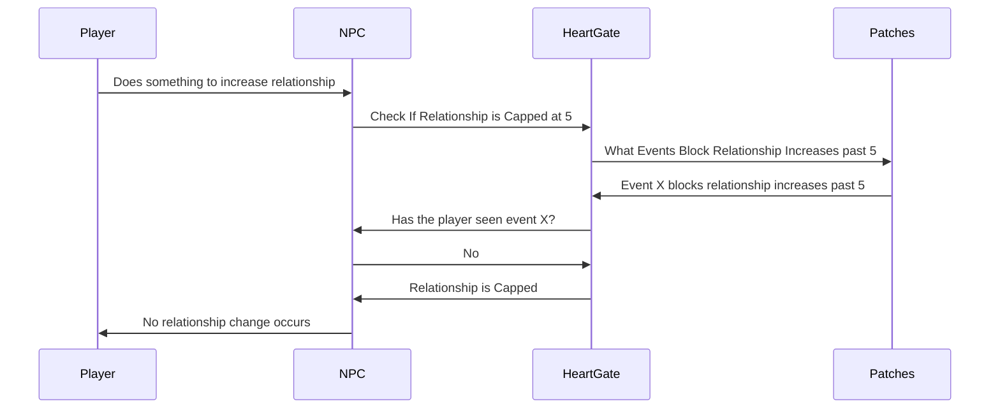

# HeartGate

## Design

```mermaid

sequenceDiagram;
    
    participant Player
    participant NPC
    participant HeartGate
    participant Patches
    
    Player ->> NPC: Does something to increase relationship
    NPC ->> HeartGate: Check If Relationship is Capped at 5
    HeartGate ->> Patches: What Events Block Relationship Increases past 5
    Patches ->> HeartGate: Event X blocks relationship increases past 5
    HeartGate ->> NPC: Has the player seen event X?
    NPC ->> HeartGate: No
    HeartGate ->> NPC: Relationship is Capped
    NPC ->> Player: No relationship change occurs

```